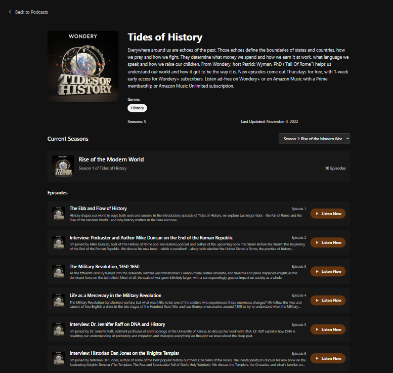

# DJS05: Show Detail Page with Routing and Navigation

### Project Overview

In this project, I built a podcast show detail page as part of a larger podcast browsing app. Upon users selecting a show from the homepage or listing page, they  taken to a dedicated page that displays all details about that show. The app supports dynamic routing so each show has its own unique URL.

I implemented data fetching based on the show ID in the URL, handled loading and error states gracefully, and ensured a smooth user experience by preserving search filters and pagination when users navigate back to the homepage. Additionally, I built a season navigation system allowing users to expand or switch between seasons to browse episodes efficiently.

This project demonstrates my ability to work with 
- Dynamic routes, 
- Manage state across pages, 
- Handle asynchronous data, and 
- Create a clean, 
- Maintainable React codebase.

### Core Objectives
- I Implement dynamic routing for unique show detail pages.
- I Passed the correct show ID via route parameters and use it to fetch specific show data.
- I Gracefully handled loading, error, and empty states during data fetching.
- I Displayed comprehensive show details including title, image, description, genres, and last updated date.
- I Preserved previous filters and search state when navigating back to the homepage.
- I Created an intuitive season navigation UI to expand and switch between seasons without excessive scrolling.
- I Displayed episode information clearly with numbering, titles, images, and shortened descriptions.
- I Maintained high code quality with documentation (JSDoc) and consistent formatting.

### How to run this Project
After Forking, Cloning, or Downloading and Saving this file on your local machine, Follow the below instructions.

1. Open the project on your Code editor
2. Open your Terminal
3. Ensure you also Install React Router DOM
    - `npm install react-router-dom`
3. Ensure you also Install React Icons
    - `npm install react-icons`
5. Run this to Scaffold you React App.
    - `npm run dev`
    - Press "Enter + h"
    - Press "Enter + o"

### Output

